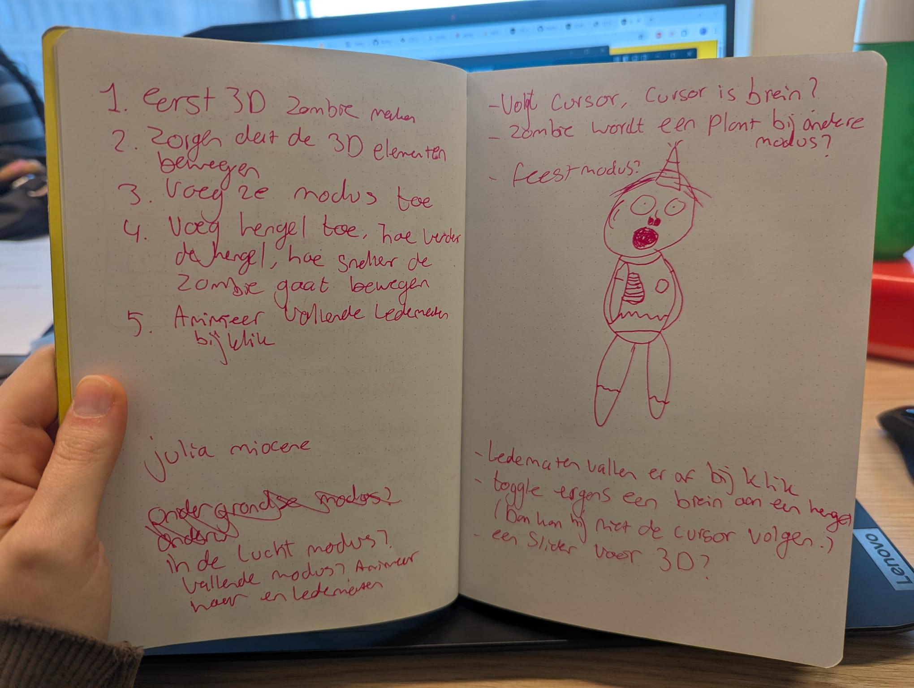
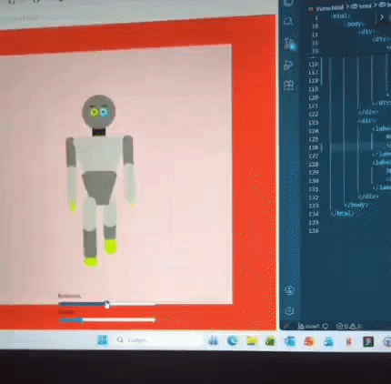
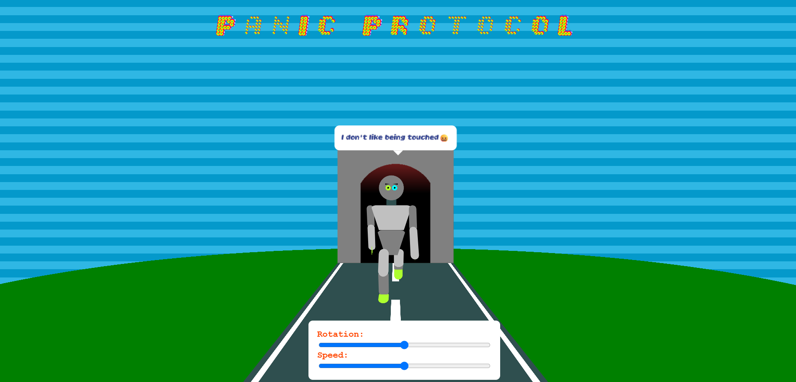

# css-to-the-rescue

## Woensdag 18-2-2026 Checkout

Vandaag was de kick-off van het vak CSS to the rescue. Ik heb onderzoek gedaan naar carousels door middel van CSS en HTML. Met mijn groepje heb ik een website gemaakt waar verschillende carousels te zien zijn. Morgen is de bedoeling dat wij gaan presenteren wat wij te weten zijn gekomen over carousels.

## Donderdag 19-02-2026 Checkout

Vandaag heb ik mij laten informeren door medestudenten over verschillende CSS features. Ik vond anchor elementen hierbij erg interessant. Verder heb ik nog een beetje aan BT gezeten, met name de responsiveness tweaken. 

Na de kick-off ben ik research gaan doen naar 3D elementen en ben ik met het idee gekomen om een zombie te maken voor de silly-walk opdracht. 

## Vrijdag 20-02-2026 Checkout
Vandaag ben ik begonnen met het ontwikkelen van de eindopdracht. Ik heb onderzoek gedaan naar 3d elementen. Daarna heb ik besloten dat een geheel 3d poppetje voor mij te veel werk is binnen 4 weken. Daarom wil ik eerst mijn focus legen op het animeren van een 2d poppetje wat kan switchen tussen de zijkant en de voorkant. 

Door dit te doen heb ik nog steeds de uitdaging om de benen te animeren van voor en van de zijkant.

Ook heb ik geleerd om de ledematen vanuit de romp te nesten in de html. Ook hoef ik geen label of before element te gebruiken voor de styling van de checkboxes. 

## Woensdag 04-03-2026 Checkout
Vandaag heeft Nils als gastspreker ons verteld over CSS en wat je allemaal met CSS kunt doen. Hij heeft hier meerdere projecten waar hij aan heeft gewerkt laten zien en voorbeelden gegeven. Ik denk dat het doel van Nils was om ons outside of the box laten denken bij het maken van onze websites.

Verder heb ik gewerkt aan mijn poppetje. De basis ervan staat. Ik wil verder nog animaties toevoegen aan de ledematen natuurlijk. Verder heb ik het hoofdje interactief gemaakt door er op te klikken. 

Ook heb ik tijdens de 3D workshop geleerd over het transformeren van objecten met 3D. Dit wil ik ook later gaan toepassen aan mijn ontwerp.

## Donderdag 05-03-2026 Checkout
Vandaag heb ik een workshop gevolgd over animations en een over anchors. 
Hier heb ik geleerd over hoe je dingen kunt animeren door middel van keyframes. Verder heb ik ook geleerd hoe ik elementen t.o.v. andere elementen kan plaatsen en hoe dit responsive is door middel van anchors.

Vandaag heb ik er voor gezorgd dat mijn poppetje 90 graden opzij draait, zodat je de walk van 2 opzichten kunt zien. Dit heb ik gedaan door middel van 3d transforms met perspective. Dit is een onderwerp waar ik meer over wil leren en betere dingen mee wil maken. 

Morgen wil ik wel echt beginnen aan de 'walk' zelf. Zodra ik een leuke walk animatie heb toegepast voor de side view en de front view wil ik beginnen aan de thematisering van mijn opdracht. Het lijkt me leuk om een 'error' thema te hebben. Dit activeer je door op het hoofdje te klikken. 

## Vrijdag 06-03-2026 Checkout
Vandaag ben ik begonnen aan de 'walk' animatie. De armen heb ik gedaan. Mijn idee is om een soort robot animatie te maken, dus hij loopt erg plots. 

Ik heb feedback gekregen op wat ik heb. Ik moet nog een titel toevoegen die bij mijn ontwerp past en 'wow'-waardig is.
Als ik tijd heb wil ik ook nog door middel van clip paths mijn robot mooier maken.

## Woensdag 11-03-2026 Checkout
Vandaag heb ik de animatie van de walk verbeterd en onderzoek gedaan naar animation-timing-function en hoe je deze kunt toepassen.

Verder heb ik het ook mogelijk gemaakt dat het poppetje 45 graden kan draaien zonder dat dit invloed heeft op de animatie van het poppetje. 
Hier ben ik 2 uur mee bezig geweest.

Met de animatie inclusief het onderzoek ben ik zo'n 3 uur bezig geweest.

Morgen wil ik de loop-animatie afmaken en een pakkende titel toevoegen voor mijn poppetje. Als er tijd voor is wil ik ook een start/stop met lopen checkboxje toevoegen.

## Donderdag 12-03-2026 Checkout
Vandaag heb ik de animatie helemaal afgemaakt!!! Ook heb ik oogjes en wenkbrauwen toegevoegd aan het poppetje. Verder heb ik een workshop over gradients en een over typografie gevolgd. 

De hele ochtend en begin van de middag ben ik bezig geweest met het proberen van het finetunen van de animatie. Dus ik ben veel tijd hier aan kwijtgeraakt. 

Ook heb ik in plaats van checkboxes een slider toegevoegd om de robot te draaien.

Morgen wil ik de 'dans' animatie gaan maken en een party thema toevoegen.

## Vrijdag 13-03-2026 Week samenvatting
Deze week ben ik bezig geweest met het afmaken van de robot en het zorgen voor een 3D omgeving voor de robot. Ik ben helaas nog niet aan typografie toegekomen. Ik moet dus echt meters gaan maken nu. Ik wil verder gaan met het bouwen van het thema. Ik heb ervoor gekozen om in plaats van 'party' er een overload modus van te maken. Omdat ik dit meer bij een robot vind passen.

Ik ben vandaag begonnen met het zetten van de robot in een kubus, waardoor het lijkt alsof er voorwerpen langs de robot vliegen.

## Woensdag 18-03-2026 Reflectie

Zondag heb ik nog verder gewerkt aan mijn robot. Ik heb ervoor gezorgd dat deze in een kubus zit die rond kan draaien. Ook heb ik voor beide thema's nog gradients toegevoegd in de kubus. Hierdoor lijkt het bij het default thema alsof er tandwieltjes voorbij vliegen en bij het overload thema krijg je een regenboog effect.

In de video hier onder zie je een voorbeeld van de basis kubus.

Uiteindelijk nadat ik de thema's heb toegepast heb ik nog een font toegevoegd en een textwolkje voor de robot.

Ik ben blij met wat ik heb gemaakt. En ik heb erg veel geleerd tijdens het proces.

Ik heb een aantal nieuwe dingen geleerd bij het maken van deze opdracht: 
- Ik heb geleerd hoe gradients werken en hoe ik die kan maken en animeren.
- Ik heb geleerd hoe ik een poppetje kan maken in CSS waarbij de elementen relatief zijn aan elkaar.
- Ik heb geleerd hoe ik elementen kan animeren, hierbij heb ik gebruik gemaakt van transforms, keyframes en transform-origin.
- Ik heb geleerd hoe ik 3d omgevingen maak met CSS en hoe ik deze kan animeren.
- Ik heb geleerd hoe containers werken in CSS.
- Ik heb geleerd hoe ik een variabele font kan toepassen in mijn websites.

Ik vond het maken van een poppetje waarbij de ledematen relatief zijn aan elkaar erg lastig. Ik ben hier dan ook een lange tijd mee bezig geweest, omdat de elementen van het poppetje in de eerste instantie niet in elkaar zaten, waardoor animaties nog lastiger zouden worden. 

Verder had ik nogsteeds moeite met het maken van een 3d omgeving, maar ik denk dat ik hier wel veel meer van begrijp dan hiervoor. Dus ik ben blij dat ik mijzelf hier in heb uitgedaagd.

Ook merkte ik dat ik moeite heb bij het aanhouden van een bepaald thema, hierdoor valt de style van mijn website niet helemaal samen. In het vervolg lijkt het me handig om hier dan ook een moodboard voor te maken.

In de foto hier onder zie je bijvoorbeeld dat de achtergrond heel natuurlijk is, terwijl de robot daar niet echt bij past. 

Het animeren van een variabele font viel me nog mee. Dit ging wel zoals ik had verwacht, dus daar was ik blij mee.
Ook het toepassen van containers in CSS ging goed.

Ik heb geprobeerd om delays toe te voegen door middel van de sibling-count() methode in CSS. Ik merkte dat dit ook zijn limieten had. Ik had namelijk mijn span elementen in divs gezet, zodat er een andere animatie op gedaan kon worden. Alleen hierdoor werkte sibling-count() niet meer op de span elementen.
Ik heb geprobeerd om de sibling-count() op te slaan in een CSS variable, maar ook dit hielp niet. Daarom heb ik deze delays hard-coded in mijn CSS moeten zetten.

Ik wist wel dat je veel kunt met CSS, dit heb ik ook gezien door naar de projecten van anderen te kijken. Toch ben ik positief verbaasd dat ik dit ook kan toepassen. Ik vind het vooral heel cool dat je ontzettend veel kunt doen met gradients. Veel meer dan ik dacht.

In de toekomst wil ik meer ontdekken over wat ik kan doen met gradients en masks. Voor mijn poppetje zouden masks een goede optie zijn om hem beter vorm te geven bijvoorbeeld. 
Dit heb ik helaas niet kunnen experimenteren vanwege tijdsnood. Dus hier wil ik zeker ook onderzoek naar doen.

Verder vind ik het maken van 3D elementen ontzettend vet, dus hier wil ik ook meer van maken.

